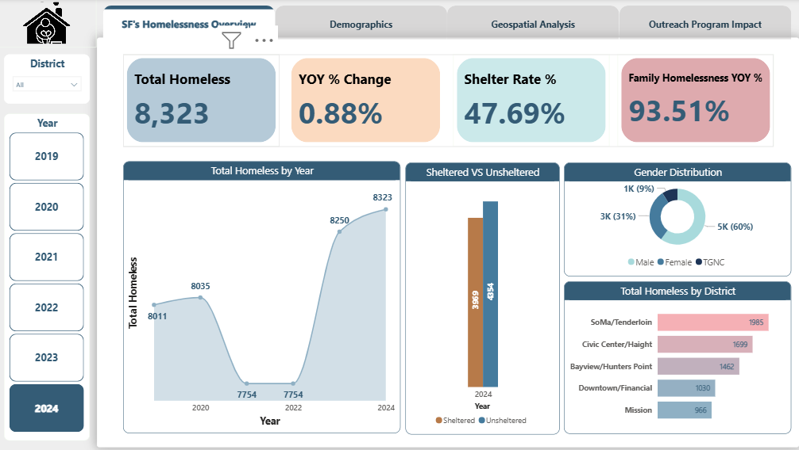
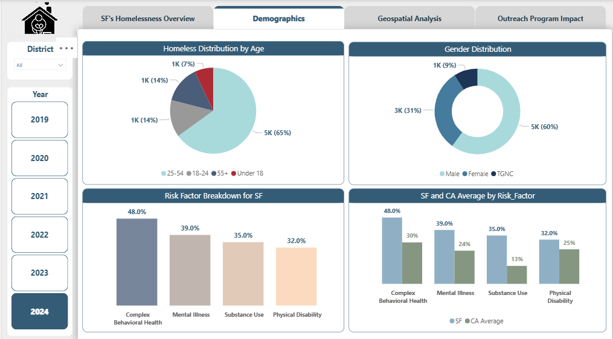
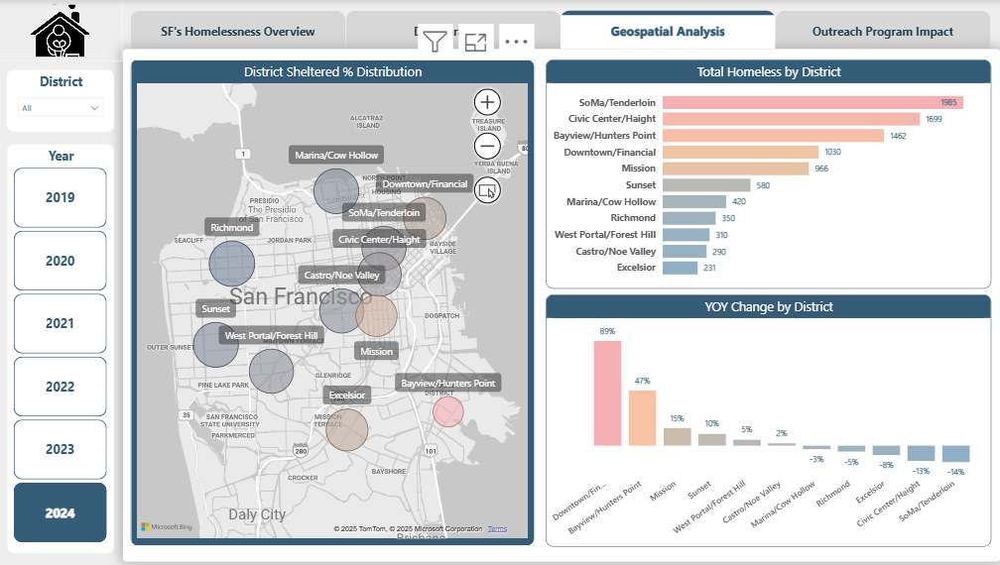
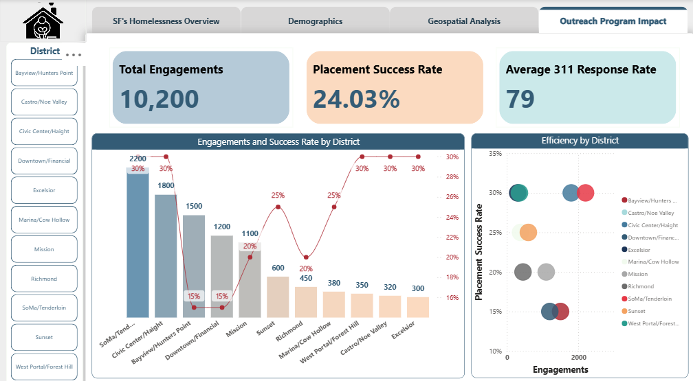
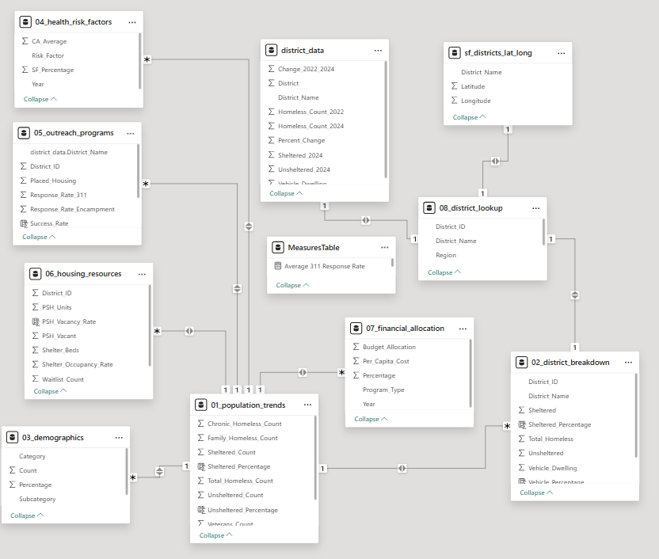

# SF Homelessness Analytics

A comprehensive Power BI dashboard showcasing San Francisco's homelessness trends, demographics, geospatial distribution, and outreach program impact.

## 🚩 Problem Statement  
Track and analyze San Francisco's homeless population over time to inform policy, allocate resources, and measure outreach effectiveness.

## 📊 Dashboard Previews  
### SF's Homelessness Overview  
  

### Demographics  
  

### Geospatial Analysis  
  

### Outreach Program Impact  
  

## 🔍 Data Sources  
- San Francisco Biennial Point-in-Time (PIT) Count [Source](https://www.sf.gov/data--homeless-population)  
- Department of Homelessness and Supportive Housing annual reports  

## 📦 Data Model  
The data model brings together eight fact and lookup tables to support cross-cutting analysis of population trends, district breakdowns, demographics, risk factors, outreach programs, housing resources, financial allocations, and district metadata. Relationships are keyed primarily on `Year` and `District_ID`, with lookup tables providing descriptive context. All DAX measures (e.g., YOY % Change, Shelter Rate %, Success Rate) are defined in the central MeasuresTable.  

**Core Tables & Relationships**  
- **01_Population_Trends** ↔ **MeasuresTable** (one-to-many on Year)  
- **02_District_Breakdown** ↔ **08_District_Lookup** (many-to-one on District_ID)  
- **02_District_Breakdown** ↔ **MeasuresTable** (Year)  
- **03_Demographics** ↔ **MeasuresTable** (Year)  
- **04_Health_Risk_Factors** ↔ **MeasuresTable** (Year)  
- **05_Outreach_Programs** ↔ **08_District_Lookup** (District_ID)  
- **05_Outreach_Programs** ↔ **MeasuresTable** (Year)  
- **06_Housing_Resources** ↔ **08_District_Lookup** (District_ID)  
- **06_Housing_Resources** ↔ **MeasuresTable** (Year)  
- **07_Financial_Allocation** ↔ **MeasuresTable** (Year)  
- **district_data** a derived summary view combining 02 through 04 for geospatial mapping  
- **st_districts_lat_long** spatial lookup joined to **08_District_Lookup** for map coordinates  

This structure ensures consistent filtering by year, seamless drill-through from high-level KPIs to district-level insights, and efficient calculation of all Power BI visuals.

## 🔍 Data Sources  
- San Francisco Biennial Point-in-Time (PIT) Count [Source](https://www.sf.gov/data--homeless-population)  
- Department of Homelessness and Supportive Housing annual reports  

## 🗂️ Dataset Overview  
All raw CSVs reside in the `Dataset/` folder. Each file schema is described below:

**01_population_trends.csv**  
- `Year`  
- `Total_Homeless_Count`  
- `Sheltered_Count`  
- `Unsheltered_Count`  
- `Chronic_Homeless_Count`  
- `Family_Homeless_Count`  
- `Youth_Homeless_Count`  
- `Veterans_Count`  

**02_district_breakdown.csv**  
- `District_ID`  
- `District_Name`  
- `Year`  
- `Total_Homeless`  
- `Sheltered`  
- `Unsheltered`  
- `Vehicle_Dwelling`  
- `YOY_Change_Pct`  

**03_demographics.csv**  
- `Year`  
- `Category` (Gender | Age)  
- `Subcategory` (Male | Female | TGNC | Under 18 | 18–24 | 25–54 | 55+)  
- `Count`  
- `Percentage`  

**04_health_risk_factors.csv**  
- `Year`  
- `Risk_Factor` (Mental Illness | Substance Use | Complex Behavioral Health | Physical Disability)  
- `SF_Percentage`  
- `CA_Average`  

**05_outreach_programs.csv**  
- `Year`  
- `District_ID`  
- `Total_Engagements`  
- `Placed_Housing`  
- `Response_Rate_311` (minutes)  
- `Response_Rate_Encampment` (minutes)  

**06_housing_resources.csv**  
- `Year`  
- `District_ID`  
- `Shelter_Beds`  
- `Shelter_Occupancy_Rate` (%)  
- `PSH_Units`  
- `PSH_Vacant`  
- `Waitlist_Count`  

**07_financial_allocation.csv**  
- `Year`  
- `Program_Type`  
- `Budget_Allocation` (USD)  
- `Percentage`  
- `Per_Capita_Cost` (USD)  

**08_district_lookup.csv**  
- `District_ID`  
- `District_Name`  
- `Region`  

## 🎯 KPIs & Metrics  
- Total Homeless Count by Year  
- YOY % Change in Total and Family Homelessness  
- Shelter Rate %  
- Gender & Age Distribution  
- Risk Factor Prevalence vs. CA Average  
- District-level Engagements & Placement Success Rate  

## ✨ Dashboard Features  
- Year-over-year trend charts  
- District-level maps with choropleth layers  
- Drill-through capability from district to individual case metrics  
- Slicers for year, district, demographic filters  

## 🛠️ Tech Stack  
- Power BI Desktop  
- SQL Server (for data prep)  
- CSV datasets  
- TomTom & Microsoft basemap integration for geospatial visualizations  

## 🚀 How to Use  
1. Clone the repository  
2. Place raw CSVs into `Dataset/`  
3. Open `PBIX/SF_Homelessness.pbix` in Power BI Desktop
4. Change the data source folder to match your local folder  
5. Refresh data sources to view updated visuals  

---

# 📊 Detailed Analysis Report

## Executive Summary  
**Key Findings:** San Francisco's homeless population increased modestly from 8,011 in 2020 to 8,323 in 2024 (0.88% YOY growth), with 52% remaining unsheltered. Family homelessness surged 93.51% year-over-year, while risk factors—particularly complex behavioral health (48%) and mental illness (39%)—significantly exceed California averages, indicating critical need for targeted interventions.

## Historical Trends and Population Dynamics

### Overall Population Growth
San Francisco's biennial Point-in-Time counts reveal a complex trajectory of homelessness over the past four years. Starting at **8,011 individuals** in 2020, the population initially declined to **7,754** in 2022 before surging to **8,323** by 2024[1]. This represents a net **0.88% year-over-year increase**, demonstrating the persistent challenge of addressing homelessness in the city.

### Shelter Status Analysis
The 2024 data shows **3,969 sheltered** versus **4,354 unsheltered** individuals, resulting in a **47.69% shelter rate**[1]. While this indicates expanded shelter capacity compared to historical baselines, the fact that 52% of the homeless population remains unsheltered underscores significant gaps in emergency housing infrastructure.

### Family Homelessness Crisis
The most alarming trend is the **93.51% year-over-year increase in family homelessness**[1], representing acute housing instability among families with children. This surge demands immediate policy attention and specialized family-focused interventions.

## Demographic Profile

### Age Distribution
The homeless population skews toward working-age adults, with **65% between ages 25-54**[1]. Additional breakdowns include:
- **18-24 years**: 14%
- **55+ years**: 14%  
- **Under 18**: 7%

This distribution suggests that homelessness primarily affects individuals during their prime working years, highlighting employment and housing affordability as key contributing factors.

### Gender Composition
Males represent the majority at **60%**, followed by females at **31%** and transgender/gender non-conforming individuals at **9%**[1]. The significant TGNC representation (9%) indicates this population faces disproportionate housing instability.

## Geographic Distribution and District Analysis

### Highest Concentration Areas
Three districts account for the majority of San Francisco's homeless population[1]:
1. **SoMa/Tenderloin**: 1,985 individuals (24% of total)
2. **Civic Center/Haight**: 1,699 individuals (20% of total)
3. **Bayview/Hunters Point**: 1,462 individuals (18% of total)

### Year-over-Year District Changes
The geographic distribution has shifted significantly, with notable increases in[1]:
- **Downtown/Financial**: +89% YOY
- **Bayview/Hunters Point**: +47% YOY
- **Mission**: +15% YOY

Conversely, some districts experienced decreases:
- **Excelsior**: -14% YOY
- **Civic Center/Haight**: -13% YOY
- **SoMa/Tenderloin**: -14% YOY

## Risk Factor Analysis

### San Francisco vs. California Comparison
San Francisco's homeless population exhibits significantly higher rates of complex health and behavioral challenges compared to California averages[1]:

| Risk Factor | SF Rate | CA Average | Difference |
|-------------|---------|------------|------------|
| Complex Behavioral Health | 48% | 30% | +18% |
| Mental Illness | 39% | 24% | +15% |
| Substance Use | 35% | 13% | +22% |
| Physical Disability | 32% | 25% | +7% |

These elevated rates indicate that San Francisco's homeless population requires more intensive, specialized services than the state average.

## Outreach Program Performance

### Overall Metrics
The city's outreach programs achieved[1]:
- **Total Engagements**: 10,200
- **Placement Success Rate**: 24.03%
- **Average 311 Response Time**: 79 minutes

### District-Level Performance Variation
Outreach effectiveness varies significantly across districts:

**High-Performing Districts (30% success rate)**:
- SoMa/Tenderloin: 2,200 engagements
- Civic Center/Haight: 1,800 engagements

**Moderate-Performing Districts (20-25% success rate)**:
- Bayview/Hunters Point: 1,500 engagements
- Downtown/Financial: 1,200 engagements

**Lower-Performing Districts (15-20% success rate)**:
- Mission: 1,100 engagements
- Various smaller districts: 300-600 engagements each

## Strategic Recommendations

### Immediate Priorities
1. **Expand Shelter Capacity**: Address the 52% unsheltered rate through emergency housing expansion
2. **Family-Focused Interventions**: Develop specialized programs to address the 93.5% spike in family homelessness
3. **Behavioral Health Integration**: Create comprehensive services addressing the 48% complex behavioral health rate

### Geographic Targeting
Focus resources on high-growth districts:
- **Downtown/Financial**: Despite 89% YOY growth, maintains only 20% placement success
- **Bayview/Hunters Point**: 47% population growth requires expanded outreach capacity

### Service Enhancement
- **Mental Health Services**: Address the 39% prevalence rate (15% above state average)
- **Substance Use Treatment**: Target the 35% rate (22% above state average)
- **Integrated Care Models**: Develop programs addressing multiple concurrent risk factors

## Methodology and Data Limitations

This analysis is based on San Francisco's biennial Point-in-Time counts, which provide snapshots rather than continuous monitoring. The data represents individuals experiencing homelessness on specific count dates and may not capture the full scope of housing instability throughout the year.

## Conclusion

San Francisco's homelessness crisis requires a multi-faceted approach addressing both immediate shelter needs and underlying risk factors. The concentration of complex behavioral health and mental illness cases, combined with the family homelessness surge, demands coordinated interventions across housing, health, and social services. Success will require sustained investment in both emergency responses and long-term supportive services tailored to the city's unique demographic and geographic challenges.

---

## 📜 License  
MIT License. See [LICENSE](LICENSE) for details.
